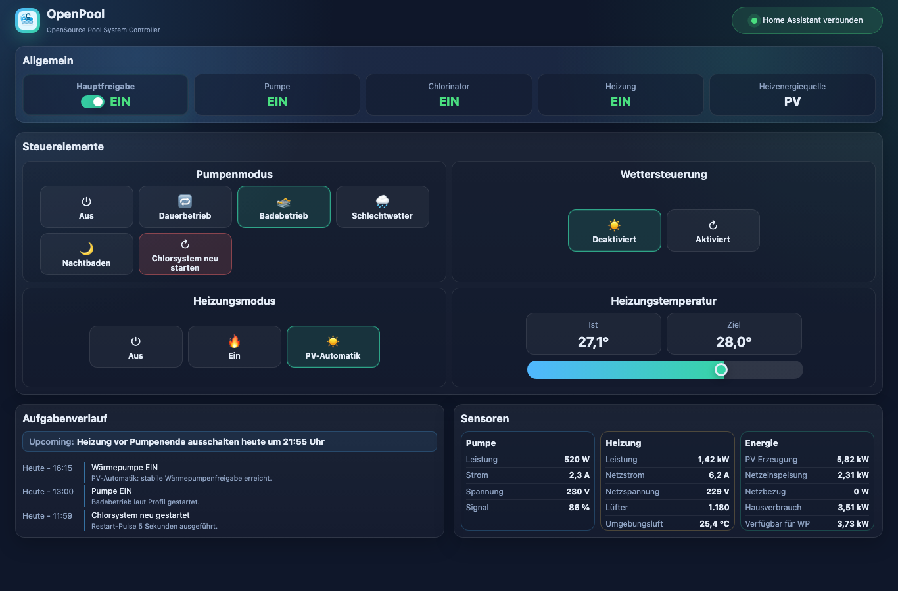
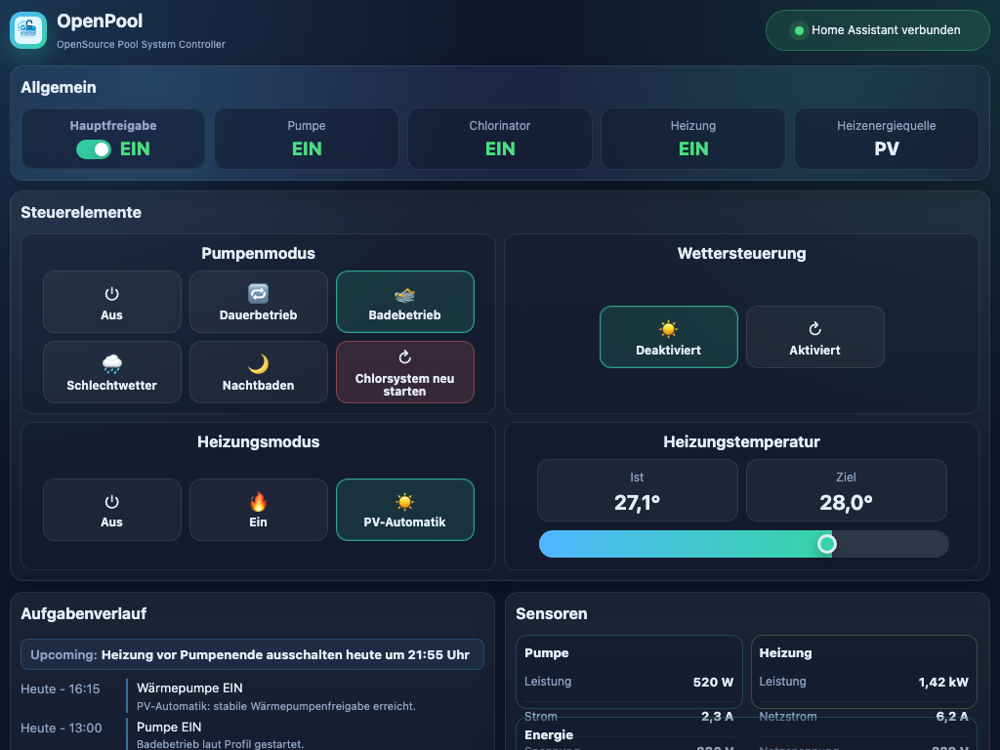
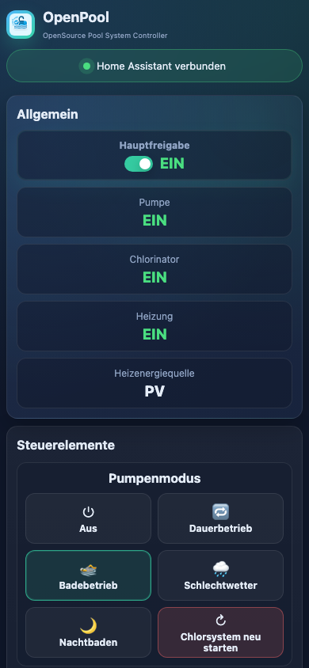

# OpenPool

[English version](README.en.md)

OpenPool ist ein OpenSource Pool System Controller fuer Home Assistant. Das
Add-on steuert Pumpe, Chlorsystem, Waermepumpe, Wetterprofile und
PV-Ueberschussheizung aus einer kompakten Weboberflaeche. Die eigentliche
Automatik laeuft serverseitig im Home Assistant Add-on, damit Browser, iPad und
Smartphone immer denselben Zustand sehen.

OpenPool ist derzeit gezielt fuer Setups rund um das Intex 26680
Sandfilter-/Salzwasserelektrolyse-System ausgelegt. Andere Systeme koennen
funktionieren, sind aber noch nicht der primaere Entwicklungsfokus.

## Screenshots

| Desktop | Tablet | iPhone |
| --- | --- | --- |
|  |  |  |

## Warum OpenPool entstanden ist

Ausgangspunkt war ein Intex Frame Pool, der im Sommer sauber und ohne staendige
Handarbeit laufen sollte. Die originale Filterpumpe war zu schwach, die spaeter
nachgeruestete Intex 26680 Kombination aus Sandfilter und Salzwasserelektrolyse
war besser, aber in der Zeitsteuerung unflexibel. Ein Tasmota Smartplug machte
das Schalten bequemer und zeigte nebenbei, dass der Chlorinator nach einem
kurzen Stromverlust wieder startet.

Mit einer Waermepumpe wurde daraus ein echtes Steuerungsproblem: Die
Waermepumpe braucht sicheren Volumenstrom, die Pumpe muss fuer Chlorung und
Profile aber weiterhin gezielt geschaltet werden. OpenPool verbindet diese
Logik mit den ohnehin vorhandenen Home-Assistant-Entitaeten.

## Funktionen

- Pumpenprofile: Aus, Dauerbetrieb, Badebetrieb, Schlechtwetter und
  Nachtbaden.
- Einstellbare Nachtbadedauer und Restart-Pulse fuer das Chlorsystem.
- Chlorinator-Erkennung ueber die Pumpenleistung.
- Waermepumpensteuerung mit Zieltemperatur, Start-Betriebsmodus,
  Pumpennachlauf und optionaler PV-Automatik.
- PV-Freigabe mit Start-/Stoppgrenzen und Stabilzeiten.
- Wettersteuerung als Empfehlung oder Automatik fuer Badebetrieb und
  Schlechtwetterprofil.
- Provider-neutrale Wetter-Entitaet, nur zwei Vorhersageabrufe pro Tag.
- Live-Sync zwischen mehreren offenen Oberflaechen.
- Persistenter Controller-State in `/data/openpool_state.json`.
- Konfiguration komplett ueber Home Assistant Add-on-Optionen.

## Wichtig vor dem ersten Start

Die Entity-IDs in der Add-on-Konfiguration muessen vor dem ersten Live-Test an
deine Home-Assistant-Installation angepasst werden. Die Standardwerte sind nur
Beispiele aus der urspruenglichen OpenPool-Anlage.

Besonders wichtig sind:

- `entities.pump_switch`
- `entities.heater_climate`
- `entities.heater_operation_mode`
- `entities.weather`
- `entities.pv_generation`
- `entities.pv_export`
- `entities.grid_import`
- Pumpen- und Heizungssensoren fuer Leistung, Strom, Spannung, Signal und
  Temperaturen

Wenn diese Entitaeten nicht passen, kann OpenPool starten, aber keine sauberen
Entscheidungen treffen oder Befehle an die richtigen Geraete senden.

## Installation

1. In Home Assistant **Einstellungen -> Add-ons -> Add-on Store** oeffnen.
2. Unter **Repositories** dieses Repository hinzufuegen:
   `https://github.com/cococheaf/ha-openpool`
3. Store neu laden und **OpenPool** installieren.
4. Add-on-Konfiguration anpassen, insbesondere alle Entitaeten.
5. Add-on starten und **In Seitenleiste anzeigen** aktivieren.

## Dokumentation

- Add-on-Dokumentation: [openpool/DOCS.md](openpool/DOCS.md)
- Changelog: [openpool/CHANGELOG.md](openpool/CHANGELOG.md)
- Home Assistant Add-on: [openpool/](openpool/)

## Releases

Versionierte Releases entstehen ueber Git-Tags im Format `vX.Y.Z`. Beim Push
eines Tags erstellt GitHub Actions automatisch einen GitHub Release aus dem
passenden Abschnitt in `openpool/CHANGELOG.md`.
