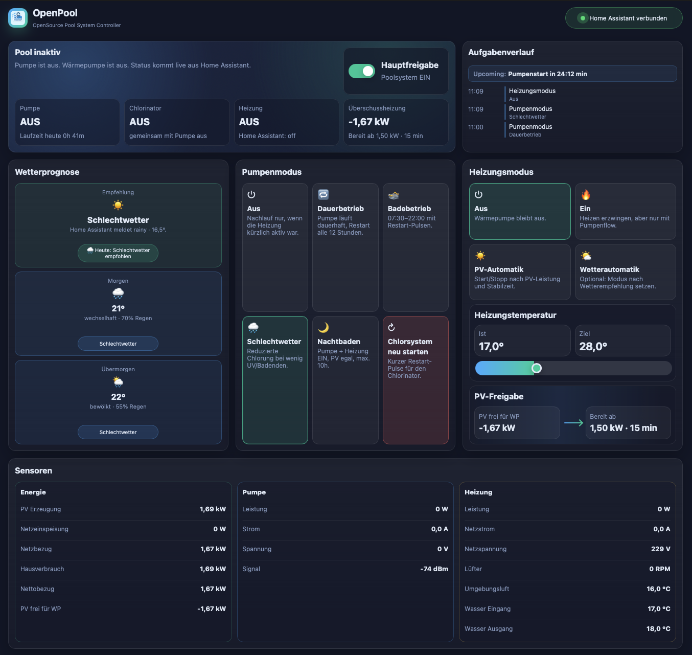

# OpenPool

[English version](README.en.md)

OpenPool ist ein OpenSource Pool System Controller für Home Assistant. Das
Projekt steuert Pumpe, Chlorsystem, Wärmepumpe und PV-Überschussheizung aus
einer kompakten, tabletfreundlichen Oberfläche und übernimmt die eigentliche
Automatik serverseitig im Home Assistant Add-on.

Aktuell ist OpenPool gezielt für ein Setup rund um das Intex 26680
Sandfilter-/Salzwasserelektrolyse-System ausgelegt. Andere Systeme können
funktionieren, sind derzeit aber nicht der primäre Entwicklungsfokus.



## Warum es OpenPool gibt

Der Auslöser war ziemlich bodenständig: Wir wollten im Sommer einen sauberen
Pool im Garten haben, ohne jedes Mal mit Kindern, Handtüchern, Badetaschen und
dem halben Hausstand ins Freibad zu ziehen. Also kam zuerst ein Komplettset mit
einem Intex XTR Frame Pool in den Garten.

Schon in der ersten Saison wurde klar, dass die beiliegende Filterpumpe für
einen zuverlässig sauberen Pool zu wenig kann. Nachdem der Pool kippte, folgte
eine Saison später die Intex 26680 Sandfilter- und Salzwasserelektrolyse-Kombi.
Die Filter- und Chlorleistung war deutlich besser, aber die Timing- und
Steuerungsmöglichkeiten waren im Alltag frustrierend eingeschränkt.

Als pragmatische Zwischenlösung kam ein schaltbarer Tasmota Smartplug dazu.
Damit ließ sich die Anlage bequem aus Home Assistant ein- und ausschalten, ohne
ständig zum Pool laufen zu müssen. Dabei zeigte sich ein praktischer Effekt:
Nach einem Stromverlust startete der Chlorgenerator wieder mit. Also liefen die
internen Timer der Anlage weiter, während die tatsächliche Chlorproduktion über
den Smartplug getaktet wurde.

Mit der später hinzugekommenen Wärmepumpe wurde diese Bastellösung aber zu
unzuverlässig. Die Wärmepumpe braucht Volumenstrom, die Pumpe musste für die
Chlorproduktion aber weiterhin gezielt geschaltet werden, und die vorhandenen
Geräte wussten nichts voneinander. Die Idee für OpenPool war geboren: Wenn alle
Schalter, Sensoren und Messwerte ohnehin bereits in Home Assistant vorhanden
sind, sollte Home Assistant auch die koordinierte Poolsteuerung übernehmen.

Da ich selbst nicht gut coden kann, ist OpenPool zusammen mit KI-Unterstützung
entstanden. Herausgekommen ist ein spezialisiertes Add-on, das genau den
Alltagsfall abbildet: Pool sauber halten, Wärmepumpe schützen, PV-Überschuss
nutzen und möglichst wenig manuell eingreifen müssen.

## Ziel des Projekts

OpenPool soll den Poolbetrieb zuverlässig automatisieren, ohne die Kontrolle aus
der Hand zu nehmen. Die Oberfläche bleibt bewusst einfach: Sie zeigt den
aktuellen Zustand, die nächsten Aufgaben, die wichtigsten Sensorwerte und die
zentralen Betriebsmodi. Die dauerhafte Konfiguration passiert in den Home
Assistant Add-on-Optionen.

Das Ziel ist nicht, ein universelles Pool-Leitsystem für jede denkbare
Installation zu sein. OpenPool ist für den realen Home-Assistant-Alltag gebaut:
vorhandene Entitäten eintragen, Steuerlogik aktivieren, Dashboard öffnen und
sehen, was gerade passiert.

## Was OpenPool kann

- Pumpenmodus steuern: Aus, Dauerbetrieb, Badebetrieb, Schlechtwetter und
  Nachtbaden.
- Automatische Pumpenprofile mit konfigurierbaren Start- und Endzeiten fahren.
- Nachtbadedauer über `profiles.night_swim_duration_minutes` begrenzen.
- Restart-Pulse für das Chlorsystem ausführen, damit der Chlorinator über
  gezielte Ausschaltimpulse neu startet.
- Chlorinator-Status über die Pumpenleistung ableiten, mit konfigurierbaren
  Leistungswerten für Pumpe ohne und mit Chlorinator.
- Wärmepumpe nur mit bestätigtem Pumpenflow freigeben.
- Nachlauf der Pumpe nach Heizbetrieb sicherstellen.
- PV-Überschuss für die Wärmepumpe berechnen und erst nach stabiler
  Wärmepumpenfreigabe einschalten.
- Start- und Stoppgrenzen sowie Stabilzeiten für die Wärmepumpenfreigabe
  konfigurieren.
- Tagesvorhersage der konfigurierten Home-Assistant-Wetterentität zweimal
  täglich auswerten und daraus Badewetter oder Schlechtwetter ableiten.
- Zieltemperatur der Wärmepumpe über die UI setzen.
- Laufzeiten, anstehende Aufgaben und letzte Kommandos serverseitig speichern.
- Mehrere offene Oberflächen synchron halten, zum Beispiel iPad, Smartphone und
  Browser am PC.
- Controller-State in `/data/openpool_state.json` persistieren, damit Laufzeiten
  und Jobs nach einem Add-on-Neustart erhalten bleiben.
- Wettersteuerung und Wärmepumpensteuerung über Add-on-Optionen aktivieren
  oder deaktivieren.

## Wie das System funktioniert

OpenPool läuft als Home Assistant Add-on. Die Weboberfläche wird per Home
Assistant Ingress ausgeliefert, während der Python-Controller im Add-on den
eigentlichen Zustand hält und Aktionen ausführt. Browser, iPad und Smartphone
sprechen nicht direkt mit Home Assistant, sondern mit dem OpenPool-Server. So
sehen alle Sitzungen denselben Zustand.

Der Controller liest die konfigurierten Home-Assistant-Entitäten regelmäßig aus,
berechnet daraus den OpenPool-Zustand und sendet bei Bedarf Service-Calls an
Home Assistant. Die Aktualisierungsrate ist über `poll_interval_s`
konfigurierbar.

Die Wettervorhersage wird bewusst ruhig behandelt: OpenPool fragt die
konfigurierte Weather-Entität nur zweimal täglich per Tagesvorhersage ab. Es
werden keine stündlichen Wetterwerte im Sekundentakt gepollt. Für die
Wettersteuerung zählt nur die grobe Tagesklasse: `Badewetter` bei überwiegend
sonnig oder wolkenlos, sonst `Schlechtwetter` bei stark bewölktem Himmel oder
Regen.

Im Wetterbereich kann zwischen `Empfehlung` und `Automatik` gewählt werden.
`Empfehlung` zeigt nur das empfohlene Pumpenprofil an. `Automatik` setzt den
Pumpenmodus selbst zwischen `Badebetrieb` und `Schlechtwetter`. Eine manuelle
Pumpenmodus-Auswahl pausiert die Wetterautomatik wieder.

Für die Wärmepumpenfreigabe wird der Hausverbrauch aus PV-Erzeugung, saldierender
Netzeinspeisung und Netzbezug abgeleitet:

```text
Hausverbrauch = PV-Erzeugungsleistung - Netzeinspeisung + Netzbezug
Verfügbar für WP = PV-Erzeugungsleistung - Hausverbrauch
```

Wenn die Wärmepumpe bereits läuft, wird ihre aktuelle Leistung wieder
dazugerechnet. Dadurch schaltet sie nicht sofort wieder ab, nur weil ihre eigene
Last den sichtbaren Überschuss reduziert.

## Wichtig vor dem ersten Start

Die Entitäten in der Add-on-Konfiguration müssen vor dem ersten echten Test an
deine Home-Assistant-Installation angepasst werden. Die Standardwerte sind
Beispiele aus der ursprünglichen Installation und passen wahrscheinlich nicht
unverändert zu deinem System.

Prüfe insbesondere:

- `pump_switch`: Schalter für Pumpe beziehungsweise Pumpen-/Chlorsystem.
- `heater_climate`: Climate-Entität der Wärmepumpe.
- `weather`: Wetter-Entität.
- `pv_generation`: aktuelle PV-Erzeugungsleistung.
- `pv_export`: saldierende Netzeinspeisung am Smartmeter.
- `grid_import`: Netzbezug am Smartmeter.
- Pumpen- und Heizungssensoren für Leistung, Strom, Spannung, Signal und
  Temperaturen.

Wenn diese Entitäten nicht stimmen, kann OpenPool zwar starten, aber keine
sauberen Entscheidungen treffen oder keine Befehle an die richtigen Geräte
senden.

Die Wetter-Entität ist provider-neutral. Du kannst also jede passende
Home-Assistant-Weather-Entität verwenden, zum Beispiel `weather.home`,
`weather.openweathermap` oder eine andere Integration.

## Home-Assistant-Verlauf

Standardmäßig nutzt OpenPool den von Home Assistant bereitgestellten
`SUPERVISOR_TOKEN`. Das funktioniert ohne zusätzlichen Token, Home Assistant
ordnet Service-Calls im Verlauf dann aber dem Supervisor zu.

Wenn im Home-Assistant-Verlauf stattdessen `wurde ausgelöst durch OpenPool`
stehen soll, lege in Home Assistant einen eigenen Benutzer namens `OpenPool`
an, erstelle in dessen Profil einen Long-Lived Access Token und setze in der
Add-on-Konfiguration:

```yaml
connection:
  auth_mode: openpool_user_token
  access_token: "TOKEN_DES_OPENPOOL_BENUTZERS"
```

Nur dieser Modus kann die Verlauf-Zuordnung sauber auf `OpenPool` setzen, weil
Home Assistant die Auslösung dem authentifizierten Benutzer des API-Tokens
zuordnet.

## Installation als Home Assistant Add-on

1. In Home Assistant **Einstellungen -> Add-ons -> Add-on Store** öffnen.
2. Über **Repositories** das Repository hinzufügen:
   `https://github.com/cococheaf/ha-openpool`
3. Store neu laden, **OpenPool** installieren und **In Seitenleiste anzeigen**
   aktivieren.
4. Vor dem Start die Add-on-Konfiguration prüfen und alle Entitäten anpassen.
5. Add-on starten und die Weboberfläche über die Home-Assistant-Seitenleiste
   öffnen.

## Projektstand

- `openpool/` enthält das Home Assistant Add-on und die gebündelte UI.
- Das Add-on stellt die UI über Home Assistant Ingress bereit.
- Der OpenPool-Controller besitzt den gemeinsamen Zustand und führt Pumpen-,
  Restart-Pulse- und Heizungsautomatik aus.
- Offene UI-Sitzungen erhalten den gemeinsamen Controller-State live vom Add-on,
  sodass Browser, Tablet und Smartphone synchron bleiben.

## Entwicklung

Für den Add-on-Build verwendet Home Assistant `openpool/config.yaml` und
`openpool/Dockerfile`. Die gebündelte Oberfläche liegt in
`openpool/www/index.html`.

## Releases

Versionierte Releases entstehen über Git-Tags im Format `v0.2.x`. Beim Push
eines solchen Tags erstellt GitHub Actions automatisch einen GitHub Release aus
dem passenden Abschnitt in `openpool/CHANGELOG.md`.
